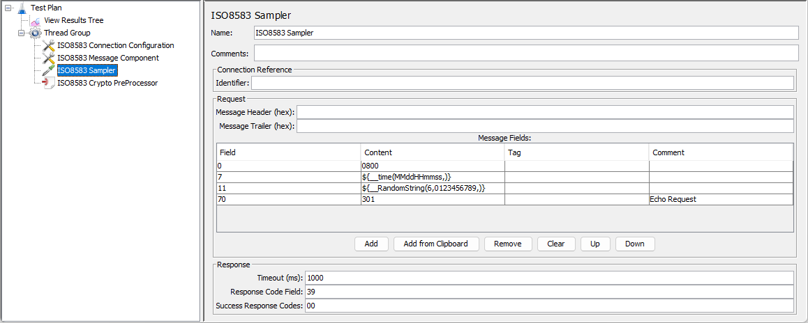
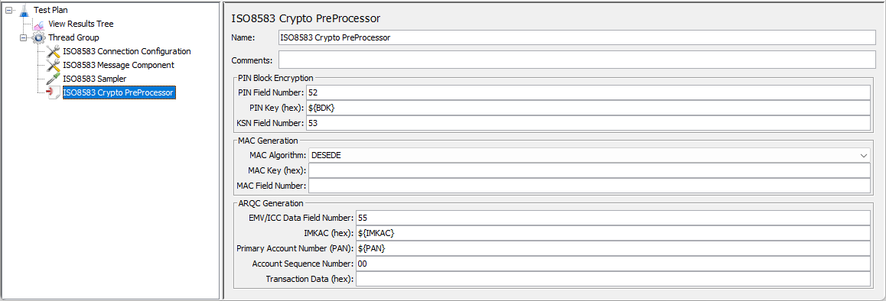

# jmeter-iso8583 [![travis][travis-image]][travis-url]

[travis-image]: https://travis-ci.com/tilln/jmeter-iso8583.svg?branch=master
[travis-url]: https://travis-ci.com/tilln/jmeter-iso8583

Overview
--------

Apache JMeter plugin for load testing of payment gateways and switches via [ISO 8583](https://en.wikipedia.org/wiki/ISO_8583) messaging, 
based on the excellent [jPOS framework](http://jpos.org/). Includes the following components:

- [*ISO8583 Sampler*](#sampler) for defining and sending messages,
- [*ISO8583 Config*](#config) for integration with the system under test,
- [*ISO8583 Message Template*](#template) (optional) for sharing common message fields,
- [*ISO8583 Crypto*](#crypto) (optional) for encryption operations of certain message elements (PIN Block, MAC, ARQC).

#### Prerequisites
A so-called Packager is required to transform ("pack") the message into its binary representation for sending it over the wire.
This plugin uses a jPOS [Generic Packager](http://jpos.org/doc/proguide.pdf#%5B%7B%22num%22%3A1736%2C%22gen%22%3A0%7D%2C%7B%22name%22%3A%22XYZ%22%7D%2C54%2C133.877%2Cnull%5D)
that needs to be configured with an XML file.

Often one of the jPOS [packager configuration files](https://github.com/jpos/jPOS/tree/master/jpos/src/dist/cfg/packager)
may be used as is or with few customisations.

#### Sample Message


In JMeter's *View Results Tree* and JTL files, request and response messages are represented 
as XML, so Extractors and Assertions can easily be used.
A hex dump of the raw (binary) message is included for troubleshooting purposes.


Usage
-----

<h3 id="config">ISO8583 Config</h3>


This Configuration element must be included to use the *ISO8583 Sampler*. 

The following fields are mandatory:
- *Channel Class*: Encapsulates the wire protocol details. 
The dropdown contains classes included in jPOS 
(refer [Channels documentation](http://jpos.org/doc/javadoc/org/jpos/iso/channel/package-summary.html)). 
If none of those are suitable, a custom channel class may be supplied (enter fully qualified class name).
- *Packager Configuration*:
XML configuration file that defines the packaging format of each message field (as per Prerequisites above).
- *Hostname*: 
    * Client mode (JMeter connects to switch): Name or IP address of the switch to connect to.
    * Server mode (switch connects to JMeter): Leave blank. JMeter will wait for incoming connection from the switch.
- *Port*: Port number to connect to (outgoing from JMeter in client mode; incoming to JMeter in server mode).

##### Implementation Details

This component encapsulates a jPOS [Q2 container](http://jpos.org/doc/proguide.pdf#%5B%7B%22num%22%3A2464%2C%22gen%22%3A0%7D%2C%7B%22name%22%3A%22XYZ%22%7D%2C54%2C769.889%2Cnull%5D)
and [QBeans services](http://jpos.org/doc/proguide.pdf#%5B%7B%22num%22%3A3393%2C%22gen%22%3A0%7D%2C%7B%22name%22%3A%22XYZ%22%7D%2C54%2C769.889%2Cnull%5D).
It manages either set of 3 components (depending on client or server mode):
- ChannelAdaptor, Channel and QMUX
- QServer, Channel and QMUX

While normally those would be configured by placing corresponding XML files into a `deploy` folder,
here it is done dynamically via transforming configuration properties from the JMeter Test Plan
into in-memory deployment descriptors (JDOM Elements).
These descriptors are then used to create and deploy QBeans at the test start and destroy them at the end.

Advanced, Channel-dependent configuration properties can be specified via name/value pairs.
For example, [`srcid` and `dstid`](https://github.com/jpos/jPOS/blob/v2_1_3/jpos/src/main/java/org/jpos/iso/channel/VAPChannel.java#L236-L237)
for VAPChannel's Base1Header.
For even more advanced use cases, above XML files may still be used and copied to the Q2 deploy folder.


<h3 id="sampler">ISO8583 Sampler</h3>



Each row of the *Message Fields* table represents one data element of the message. The columns have the following meaning:
- *Field*: Field number (decimal), with 0 being the Message Type Indicator (MTI).
- *Content*: A string representation of the field's data content. This may be a text, numeric, or binary value. 
Note that the Packager configuration determines how this is interpreted.
For example, a binary field will expect a string of hexadecimal digits (without `0x` prefix).
A text field's character encoding depends on the Packager configuration too (e.g. ASCII, EBCDIC).
- *Tag* (hexadecimal): Used for tagged fields (e.g. ICC/EMV data fields), otherwise empty.
- *Comment*: For documentation purposes.

Note that Bitmaps will be generated automatically.

Optional message header and trailers may be specified as hex digits.

#### Binary Field Content

If the field's `class` attribute in the Packager configuration file is a subclass of 
[`ISOBinaryFieldPackager`](http://jpos.org/doc/javadoc/org/jpos/iso/ISOBinaryFieldPackager.html)
the field's *Content* is treated as binary and interpreted as hex digits (replacing incorrect digits with `F`).

If the Packager's field class is not binary or cannot be determined (e.g. if there are no subfields, as for
[BERTLVBinaryPackager](http://jpos.org/doc/javadoc/org/jpos/tlv/packager/bertlv/BERTLVBinaryPackager.html),
the *Content* will be taken as is and not be interpreted as hex digits.
JMeter's function [`${__char()}`](https://jmeter.apache.org/usermanual/functions.html#__char)
can be used to enter binary values in that case.

For tagged fields, the tag value is also used to distinguish binary fields.
This works for well-known, standard EMV tags, but needs to be configured for proprietary tags.
The JMeter property `jmeter.iso8583.binaryFieldTags`


#### Response Validation

The response code can be used to distinguish failed and successful samples 
(similar to JMeter's [HTTP Request](https://jmeter.apache.org/usermanual/component_reference.html#HTTP_Request)
marking 4xx and 5xx responses as failures).
- *Timeout (ms)*: A response timeout in milliseconds can be defined individually for each sampler.
  The value 0 turn off the timeout, and should be used with care.
- *Response Code Field* (usually 39): Field number that is used to determine a sample success or failure.
- *Success Response Code* (usually 00): Expected value for successful responses.

If either of the Response Code fields are empty, no validation will be performed.

#### Subfields

For example, field 43 "Card Acceptor Location" contains 3 subfields that can be defined as follows:

|Field|Content|Tag|Comment|
|-----|-------|---|-------|
|43.1 |JMeter |   |Name   |
|43.2 |Nowhere|   |City   |
|43.3 |NZ     |   |Country|

This has to be matched by a packager configuration like the below:

```xml
    <isofieldpackager id="43"
            name="CARD ACCEPTOR LOCATION"
            length="40"
            class="org.jpos.iso.IFB_BINARY"
            packager="org.jpos.iso.packager.GenericSubFieldPackager"
            emitBitmap="false"
            firstField="1"
            maxValidField="3">
        <isofield id="1" name="NAME"    length="25" pad="false" class="org.jpos.iso.IF_CHAR"/>
        <isofield id="2" name="CITY"    length="13" pad="false" class="org.jpos.iso.IF_CHAR"/>
        <isofield id="3" name="COUNTRY" length="2"  pad="false" class="org.jpos.iso.IF_CHAR"/>
    </isofieldpackager>	
```

#### Tagged Fields

For example, field 55 with ICC/[EMV](https://en.wikipedia.org/wiki/EMV) data 
in [BER-TLV](https://en.wikipedia.org/wiki/Basic_Encoding_Rules) format can be defined as in the following example:

|Field|Content|Tag|Comment|
|-----|-------|---|-------|
|55.1|000000000199|9F02|Amount, Authorised|
|55.2|000000000000|9F03|Amount, Other|
|55.3|0554|9F1A|Terminal Country Code|
|55.4|0000000000|95|Terminal Verification Results|
|55.5|0554|5F2A|Transaction Currency Code|
|55.6|<code>${__time(yyMMdd,)}</code>|9A|Transaction Date|
|55.7|01|9C|Transaction Type|
|55.8|<code>${__RandomString(8,0123456789ABCDEF,)}</code>|9F37|Unpredictable Number|
|55.9|5C00|82|Application Interchange Profile|
|55.10|<code>${ATC}</code>|9F36|Application Transaction Counter|
|55.11|<code>${IAD}</code>|9F10|Issuer Application Data|

Provided a matching packager configuration like this:

```xml
      <isofieldpackager
          id="55"
          length="255"
          name="Integrated Circuit Card Related Data"
          class="org.jpos.iso.IFB_LLLHBINARY"
          packager="org.jpos.tlv.packager.bertlv.BERTLVBinaryPackager"
          emitBitmap="false"/>
```


<h3 id="template">ISO8583 Template</h3>


This (optional) Configuration element may be used to define fields in the same way as for the *ISO8583 Sampler*.
However, its fields will be applied to all samplers in scope, so it can be used for common data elements like dates and times.

|Field|Content|Tag|Comment|
|-----|-------|---|-------|
|7|<code>${__time(MMddHHmmss,)}</code>| |Transmission date & time|
|12|<code>${__time(HHmmss,)}</code>| |Local transaction time|
|13|<code>${__time(MMdd,)}</code>| |Local transaction date|
|15|<code>${__time(MMdd,)}</code>| |Settlement date|
|16|<code>${__time(MMdd,)}</code>| |Currency conversion date|
|17|<code>${__time(MMdd,)}</code>| |Capture date|

If any particular field number is present in the sampler as well as the template, the one in the sampler takes precedence.

If a sampler has more than one template in its scope, their fields will all be merged into the sampler, 
unless a field is already present in the sampler *or* a template in a scope closer to the sampler.

In other words, inner fields take precedence over outer ones, 
with the sampler's fields themselves being the innermost ones.


<h3 id="crypto">ISO8583 Crypto PreProcessor</h3>



This (optional) Preprocessor modifies a message, based on cryptographic calculations, 
before it is packaged and sent by the sampler.

This is necessary for some fields that can only be determined during runtime of the JMeter test,
rather than being generated before the test, as they may depend on dynamic session keys or other, dynamic message fields.

Currently supported are the following operations:
- *PIN Block Encryption*: Encrypts a clear PIN Block given a zone PIN key (ZPK) or base derivation key (BDK).
- *MAC Generation*: Calculates the MAC (Message Authentication Code), given a session MAC key.
- *ARQC Generation*: Calculates the Authorization Request Cryptogram (ARQC), given the ICC Master Key (IMKAC).

All keys need to be provided as clear (unencrypted) hex digits.

Any subset of these operations may be performed by leaving some or all of the other ones' inputs blank.
For example, if no key is present for one of the operations, it will be skipped.

As the MAC depends on the entire message content, its calculation is the last to be done.

#### PIN Block Encryption

- *PIN Field Number* (usually 52): A clear PIN Block in this field will be replaced with the encrypted one.
- *PIN Key (hex)*: Clear DES key to use as ZPK for zone PIN encryption (16, 32 or 48 hex digits), 
or Triple-DES key to use as BDK for DUKPT (32 hex digits).
- *KSN Field Number* (usually 53): Empty for zone PIN encryption. Otherwise, for DUKPT encryption, 
the 16 hex digits in this field will be interpreted as the Key Serial Number (KSN).

The KSN scheme can be configured by changing the JMeter property `jmeter.iso8583.ksnDescriptor`. 
For example, its default `6-5-5` means `bbbbbbdddddccccc` will be partitioned into 
BDK ID `bbbbbb`, Device ID `ddddd`, and Counter `ccccc`.

#### MAC Generation

- *MAC Algorithm*: Cipher algorithm name for EDE or CBC MAC calculation 
(refer [BouncyCastle specification](https://www.bouncycastle.org/specifications.html))
- *MAC Key (hex)*: Clear Triple-DES key (32 or 48 hex digits), usually from a key exchange.

The MAC field will be the next multiple of 64 from teh last field in the message (e.g. 64, 128, 192).

#### ARQC Generation

- *EMV/ICC Data Field Number* (usually 55): The ARQC input fields will be taken from **subfields** of this field, 
and the calculated ARQC value will be added as an additional subfield.
- *IMKAC (hex)*: Clear ICC Master Key for Application Cryptogram calculation.
- *Session Key Derivation Method*: How to derive the UDK from the Master Key.
- *Primary Account Number (PAN)*: Input parameter for session key derivation.
- *Account Sequence Number*: Input parameter for session key derivation (2 digits) .
- *Additional Transaction Data*: Hex digits entered here will be appended to the sequence of ARQC input bytes 
extracted from the ICC Data field. Useful if non-standard tags are to be included in the calculation.

Missing ARQC input tags will be ignored, i.e. no validation mandatory is performed that all mandatory tags are present.

Installation
------------
### Via [PluginsManager](https://jmeter-plugins.org/wiki/PluginsManager/)

Not available yet
<!--
Under tab "Available Plugins", select "ISO8583 Sampler", then click "Apply Changes and Restart JMeter".
-->
### Via Package from [JMeter-Plugins.org](https://jmeter-plugins.org/)

Not available yet
<!--
Extract the [zip package](https://jmeter-plugins.org/files/packages/tilln-iso8583-1.0.zip) into JMeter's lib directory, then restart JMeter.
-->
### Via Manual Download

1. Copy the [jmeter-iso8583 jar file](https://github.com/tilln/jmeter-iso8583/releases/download/1.0-SNAPSHOT/jmeter-iso8583-1.0-SNAPSHOT.jar) into JMeter's `lib/ext` directory.
2. Copy the following dependencies into JMeter's `lib` directory:
    * [org.jpos / jpos](https://search.maven.org/classic/remotecontent?filepath=org/jpos/jpos/2.1.3/jpos-2.1.3.jar)
    * [org.bouncycastle / bcprov-jdk15on](https://search.maven.org/classic/remotecontent?filepath=org/bouncycastle/bcprov-jdk15on/1.61/bcprov-jdk15on-1.61.jar)
    * [org.bouncycastle / bcpg-jdk15on](https://search.maven.org/classic/remotecontent?filepath=org/bouncycastle/bcpg-jdk15on/1.61/bcpg-jdk15on-1.61.jar)
    * [org.jdom / jdom2](https://search.maven.org/classic/remotecontent?filepath=org/jdom/jdom2/2.0.6/jdom2-2.0.6.jar)
    * [org.osgi / org.osgi.core](https://search.maven.org/classic/remotecontent?filepath=org/osgi/org.osgi.core/6.0.0/org.osgi.core-6.0.0.jar)
    * [commons-cli / commons-cli](https://search.maven.org/classic/remotecontent?filepath=commons-cli/commons-cli/1.4/commons-cli-1.4.jar)
    * [org.yaml / snakeyaml](https://search.maven.org/classic/remotecontent?filepath=org/yaml/snakeyaml/1.24/snakeyaml-1.24.jar)
    * [org.hdrhistogram / HdrHistogram](https://search.maven.org/classic/remotecontent?filepath=org/hdrhistogram/HdrHistogram/2.1.11/HdrHistogram-2.1.11.jar)
    * [org.javatuples / javatuples](https://search.maven.org/classic/classic/remotecontent?filepath=org/javatuples/javatuples/1.2/javatuples-1.2.jar)
3. Restart JMeter.


Configuration
-------------

### JMeter Properties

The following properties control the plugin behaviour:

- `jmeter.iso8583.q2DeployDir`: 
   Directory where Q2 looks for deployment files. Will be created if not there yet.
   (default: `deploy` subfolder from where JMeter was started).
- `jmeter.iso8583.q2StartupTimeout` (ms): 
   How long to wait until the Q2 component starts up (default: 2 seconds).
- `jmeter.iso8583.incomingConnectionTimeout` (ms): 
   How long to wait for incoming connections when running in server-mode (default: 1 minute).
- `jmeter.iso8583.channelReconnectDelay` (ms): 
   May be used to override the Q2 Channel Adaptor default of 10 seconds.
- `jmeter.iso8583.arqcInputTags`:
   Comma-separated list of hexadecimal EMV tag numbers that will be included in the ARQC calculation.
   This may be used to include additional (or exclude standard) tags
   (default: `9F02,9F03,9F1A,95,5F2A,9A,9C,9F37,82,9F36,9F10`).
- `jmeter.iso8583.binaryFieldTags`:
   Comma-separated list of hexadecimal tag numbers that will be interpreted as binary fields
   (default: none).
- `jmeter.iso8583.ksnDescriptor`:
   Defines the [Key Serial Number Scheme](https://en.wikipedia.org/wiki/Derived_unique_key_per_transaction#Practical_Matters_(KSN_scheme)),
   i.e. the length (in hex digits) of the KSN parts - BDK ID (or KSI), Device ID (or TRSM ID), transaction counter
   (default: "6-5-5").

Limitations
-----------

Some exceptions are currently only logged in the Q2 log but not in the JMeter log:
- Packager exceptions in ChannelAdaptor on receive,
- Configuration exceptions when deploying incorrect config (e.g. packager file not found)

Work-around: Increase log level `jmeter -Lnz.co.breakpoint.iso8583=DEBUG`
